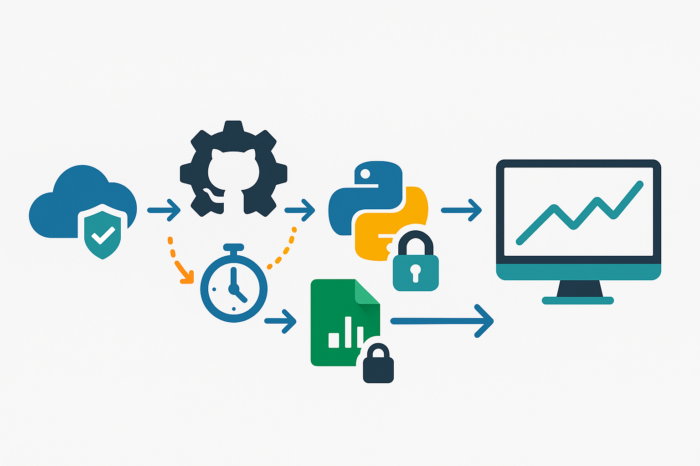

# Energy Market Data Automation Pipeline

    

A case study of a fully automated, cloud-based data pipeline built to collect, process, and store daily Australian energy market futures data. This project demonstrates proficiency in backend development, process automation, and cloud integration.

---

## 🏛️ Architecture Overview

This system is engineered for reliability and security, running entirely in the cloud with no manual intervention required. The workflow is orchestrated by GitHub Actions and leverages a secure authentication mechanism with Google Cloud IAM for data storage.

---

## 🛠️ Technology Stack

This project was built using a modern, robust set of tools and libraries:

* **Programming Language:** Python 3.10
* **Automation & CI/CD:** GitHub Actions
* **Data Collection:** Selenium for browser automation.
* **Data Storage & API:** Google Sheets, Google Apps Script
* **Cloud Authentication:** Google Cloud IAM, Service Accounts
* **Core Python Libraries:** Gspread, Requests, Pytz

---

## ✨ Key Features & Technical Accomplishments

* **Fully Automated Workflow:** Engineered a time-triggered data collection pipeline using GitHub Actions that runs on a daily schedule, ensuring consistent and up-to-date data.
* **Robust Data Ingestion:** Developed a resilient Python script for data extraction, transformation, and cleansing, featuring error handling and randomized user-agents to ensure high availability.
* **Secure Cloud Integration:** Architected a secure credential management system using GitHub Secrets and Google Cloud Service Accounts, eliminating the need for hardcoded keys and adhering to security best practices.
* **Scalable Data Storage:** Designed a two-part data storage solution within Google Sheets, featuring a "live" daily data table and a triggered archival system for building a clean, historical time-series database.
* **API-Driven Logic:** Built and deployed a secure webhook using Google Apps Script, allowing the Python backend to programmatically trigger data archival actions within the Google Workspace ecosystem.

---

## 📈 Project Status & Future Work

This project serves as a fully functional prototype and a demonstration of a modern data engineering workflow.

For a future commercial-grade application, the data ingestion module would be migrated from the current proof-of-concept method to an officially licensed API data feed to ensure 100% compliance, reliability, and data integrity.

---

## 👤 About Me

I am a technical problem-solver with a background in the energy industry, passionate about leveraging technology and automation to create efficient, data-driven solutions.

* **LinkedIn:** https://www.linkedin.com/in/trentlindop/
* **GitHub:** https://github.com/TrentLindop
